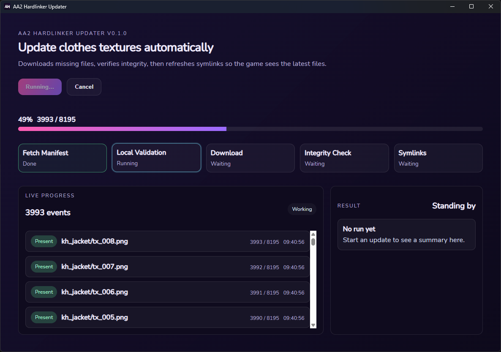

# AA2 Hardlinker



## Disclaimer
> [!NOTE]
> Large chunks of the code were written with the help of AI. The code is messy but I went with it because I wanted to get the project done as quickly as possible.
> I've reviewed all the generated code and made sure it works, but I haven't cleaned it up or refactored it. If you want to contribute to the project, please feel free to clean up the code and make it more readable.

## About
This is a tool for downloading and updating additional clothing textures for the game. It is based on the existing work done by the community.

## Installation
1. Download the latest release for your OS from the [releases page](https://github.com/R00taryEnginE/AA2Hardlinker/releases/latest).
2. Extract the program to the same directory where your game is installed.
3. Run the program and follow the instructions.

## Troubleshooting
### Program fails to start
> [!IMPORTANT]
> On Linux the program requires `libwebkit` to be installed. Use one of the following commands to install it.
```bash
# For Debian/Ubuntu-based distributions
sudo apt install libwebkit2gtk-4.1-0
# For Fedora-based distributions
sudo dnf install webkit2gtk4.1
# For Arch-based distributions
sudo pacman -S webkit2gtk-4.1
```
